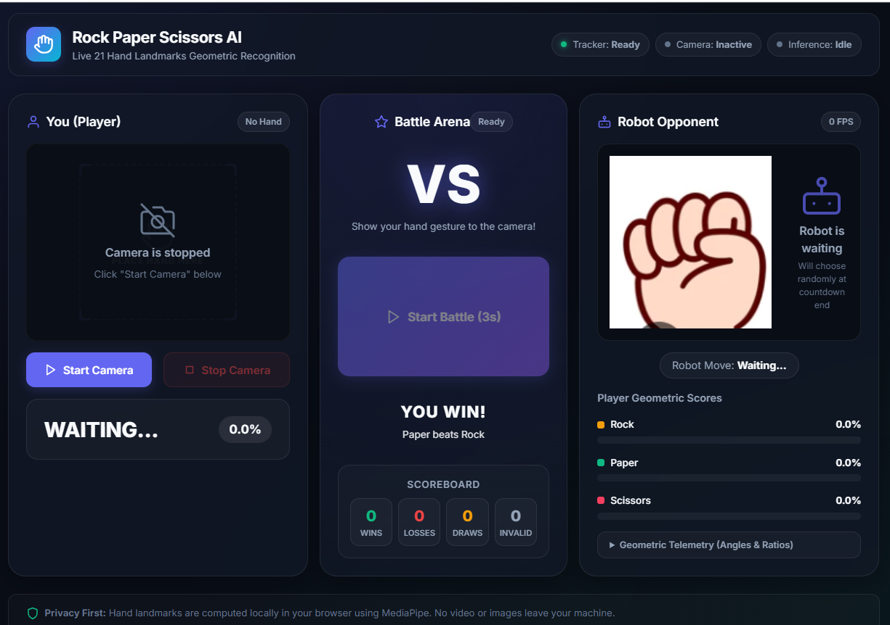
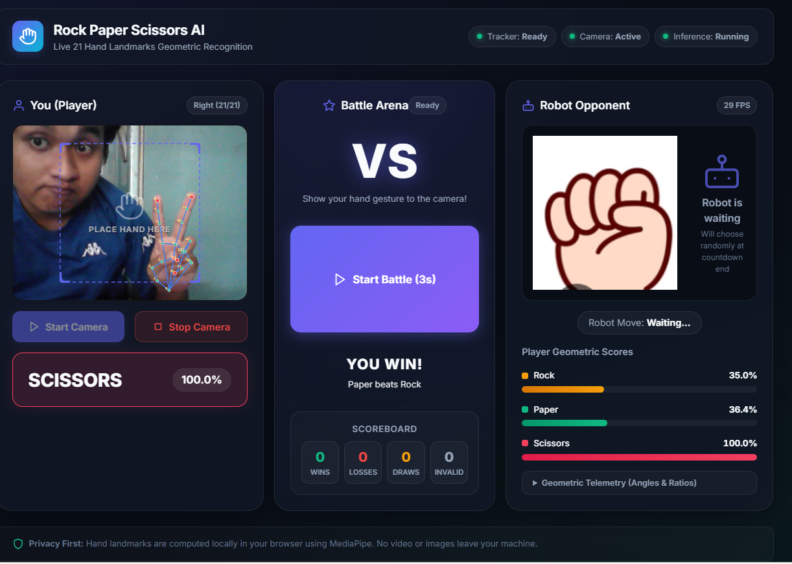
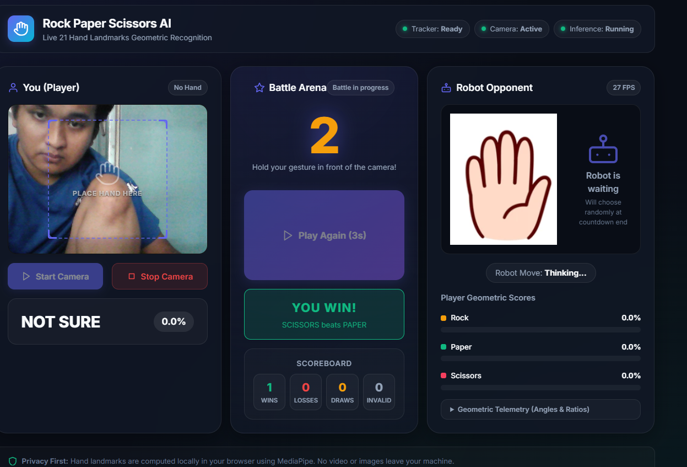
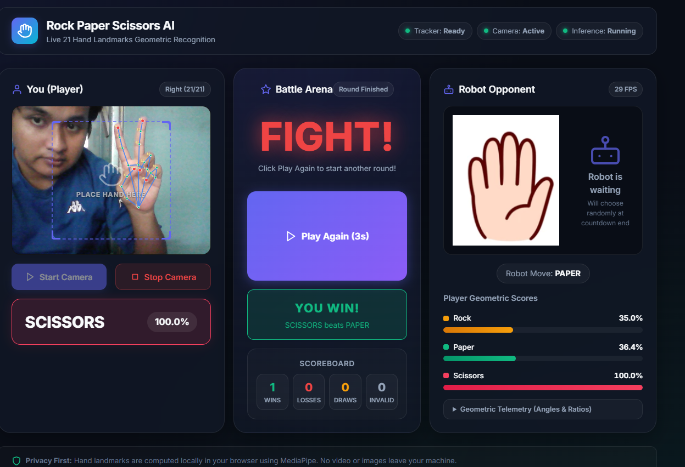

# Rock Paper Scissors AI — Live 21 Hand Landmarks & Battle Game

A real-time, in-browser **Rock Paper Scissors** game powered by **MediaPipe 21 Hand Landmarks** geometric computer vision and an interactive **VS Robot Battle Arena**. Play directly against an AI robot opponent using live webcam hand gestures with zero backend latency and complete privacy.

---

## Screenshots & Gameplay Demo

| Battle Arena Overview | Live 21 Landmarks Detection |
| :---: | :---: |
|  |  |
| *3-panel arena: Player, Countdown/Scoreboard, and Robot Opponent* | *Real-time 21 landmark points, skeleton overlay, and gesture confidence* |

| 3-Second Battle Countdown | Victory & Scoreboard Update |
| :---: | :---: |
|  |  |
| *Fair 3-second countdown before locking moves* | *Instant robot move reveal, result calculation, and scoreboard tracking* |

---

## Features

- **MediaPipe 21 Hand Landmarks**: Tracks 21 3D hand landmarks in real-time on live webcam video without sending frames to any server.
- **Pure Geometric Gesture Recognition**:
  - **ROCK**: Compact fist detection using PIP/DIP joint curl angles and tip-to-palm compactness.
  - **PAPER**: Open palm detection verifying all 5 fingers extended and fingertip-to-palm distances.
  - **SCISSORS**: V-shape geometry measuring index/middle extension, ring/pinky folding, V-gap, and V-angle separation.
- **VS Robot Battle Arena**:
  - **3-Second Battle Countdown**: 3 → 2 → 1 → FIGHT! with dynamic scaling animations.
  - **Fair & Unpredictable Opponent**: Uses `window.crypto.getRandomValues()` to choose random robot moves independently of the player.
  - **Instant Robot Reveal**: Robot images (`robot_rock.png`, `robot_paper.png`, `robot_scissors.png`) are preloaded into browser memory for zero-latency image swapping.
  - **Live Scoreboard**: Automatically tracks Wins, Losses, Draws, and Invalid moves.
- **Temporal Smoothing**: Rolling 7-frame buffer to eliminate frame-to-frame gesture jitter.
- **Geometric Telemetry Panel**: Expandable live debug panel showing joint angles, normalized tip ratios, and V-angles.
- **100% Client-Side & Privacy First**: All inference and game logic run strictly inside your browser.

---

## Project Structure

```text
paper_scissor/
├── docs/
│   └── screenshots/             # Gameplay and UI screenshots
│       ├── 01_game_overview.png
│       ├── 02_scissors_detection.png
│       ├── 03_battle_win.png
│       └── 04_countdown_in_progress.png
├── assets/                      # Robot opponent artwork
│   ├── robot_rock.png
│   ├── robot_paper.png
│   └── robot_scissors.png
├── web/
│   ├── index.html               # Battle Arena layout & UI structure
│   ├── styles.css               # Modern dark-neutral styling & design system
│   ├── app.js                   # MediaPipe landmark tracking & game battle logic
│   └── assets/                  # Web-accessible robot assets
├── scratch/
│   ├── test_geometry.js         # Landmark geometry test suite
│   └── test_game_logic.js       # Game rules & asset test suite
├── train.py                     # (Optional) MobileNetV2 CNN training script
├── convert_to_tfjs.py           # (Optional) Keras to TF.js conversion script
└── requirements.txt             # Python dependencies
```

---

## Running the Web Application

### Option 1: Using XAMPP / Apache (Recommended)

If your project is located in `htdocs` (e.g. `c:\xampp\htdocs\paper_scissor`):
1. Start Apache from the **XAMPP Control Panel**.
2. Open your browser and visit:
   ```text
   http://localhost/paper_scissor/web/
   ```

### Option 2: Using Python HTTP Server

```bash
cd web
python -m http.server 8000
```

Open your browser and navigate to:
```text
http://localhost:8000
```

> [!WARNING]
> **Do not open `index.html` directly via `file://`**. Modern browsers restrict webcam access (`getUserMedia`) and ES module loading via the `file://` protocol. Always access through an HTTP server (e.g., `http://localhost/...`).

---

## How to Play

1. Allow webcam permissions when prompted by your browser.
2. Click **Start Camera** to initialize MediaPipe HandLandmarker.
3. Once the camera is active, click **Start Battle (3s)**.
4. During the 3-second countdown (3 → 2 → 1 → FIGHT!), hold your gesture (**Rock**, **Paper**, or **Scissors**) in view of the camera.
5. At **FIGHT!**, your gesture is locked, the robot randomly reveals its move, and the winner is calculated immediately.
6. Check your updated score on the **Scoreboard** and click **Play Again** for another round!

---

## Geometric Recognition Rules

| Gesture | Finger Extension | Joint Angles & Distances |
| :--- | :--- | :--- |
| **ROCK** | All 4 fingers curled | Index, Middle, Ring, Pinky PIP $\le 145^\circ$, Tip-to-Palm $\le 0.85$ |
| **PAPER** | All 5 fingers extended | Index, Middle, Ring, Pinky PIP $\ge 150^\circ$, DIP $\ge 140^\circ$, Tip-to-Palm $\ge 0.88$ |
| **SCISSORS** | Index & Middle extended, Ring & Pinky folded | V-gap $\ge 0.25$, V-angle between $10^\circ$ and $80^\circ$ |

---

## License

MIT License.
